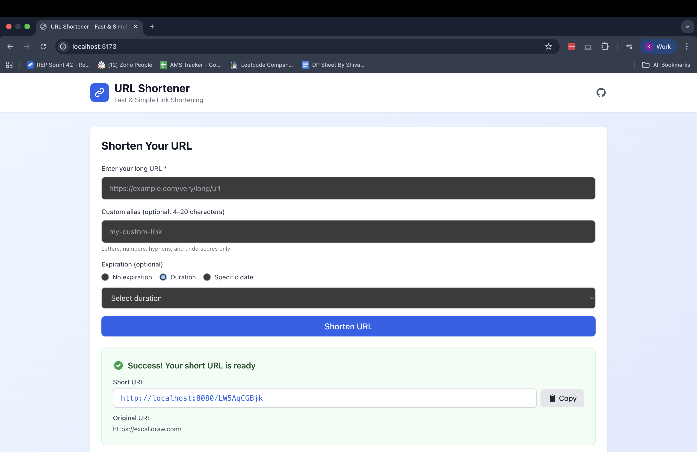
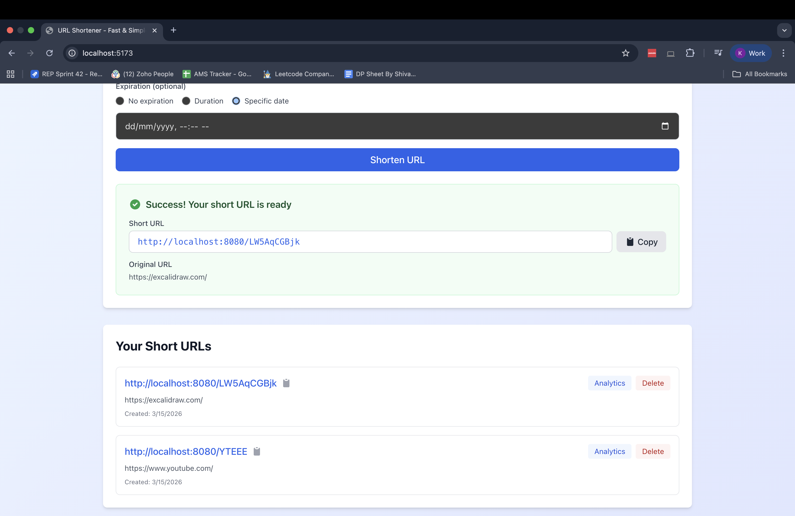
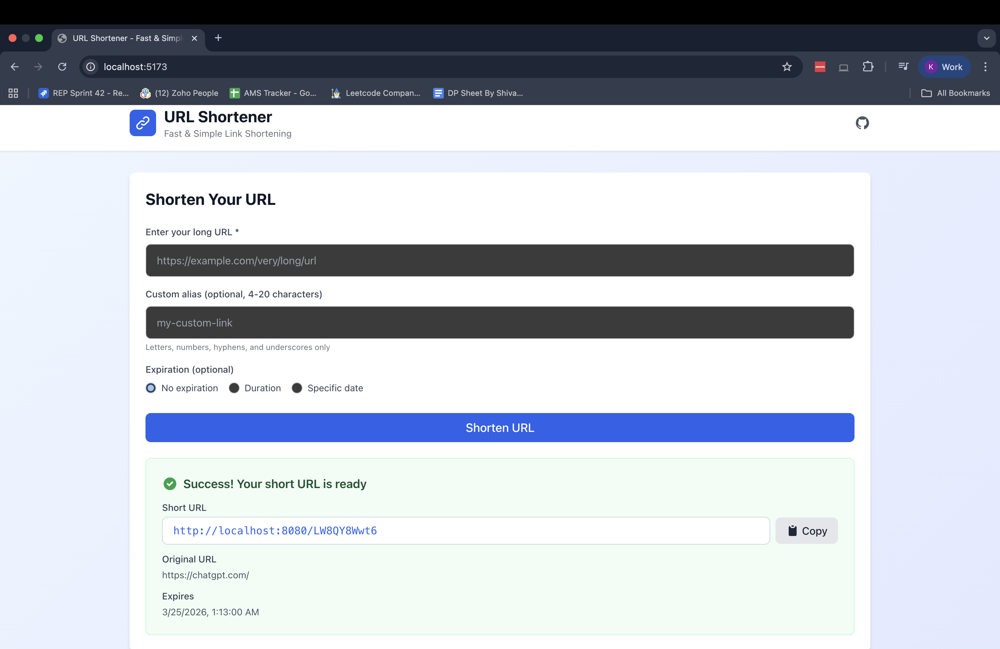
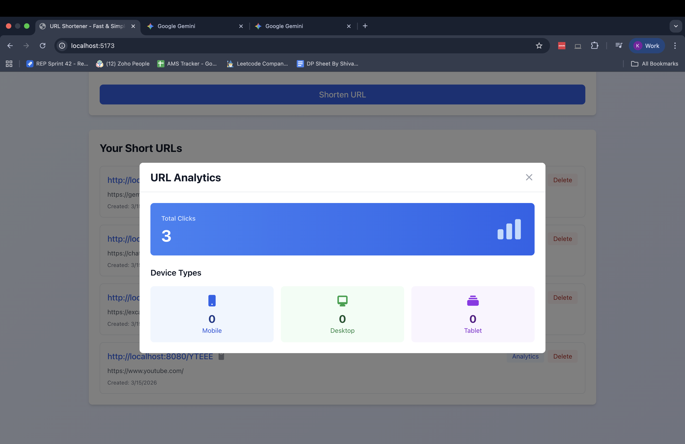
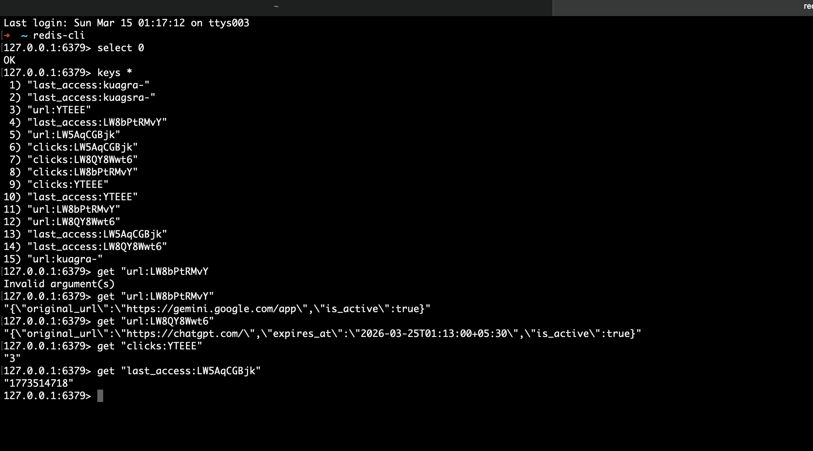
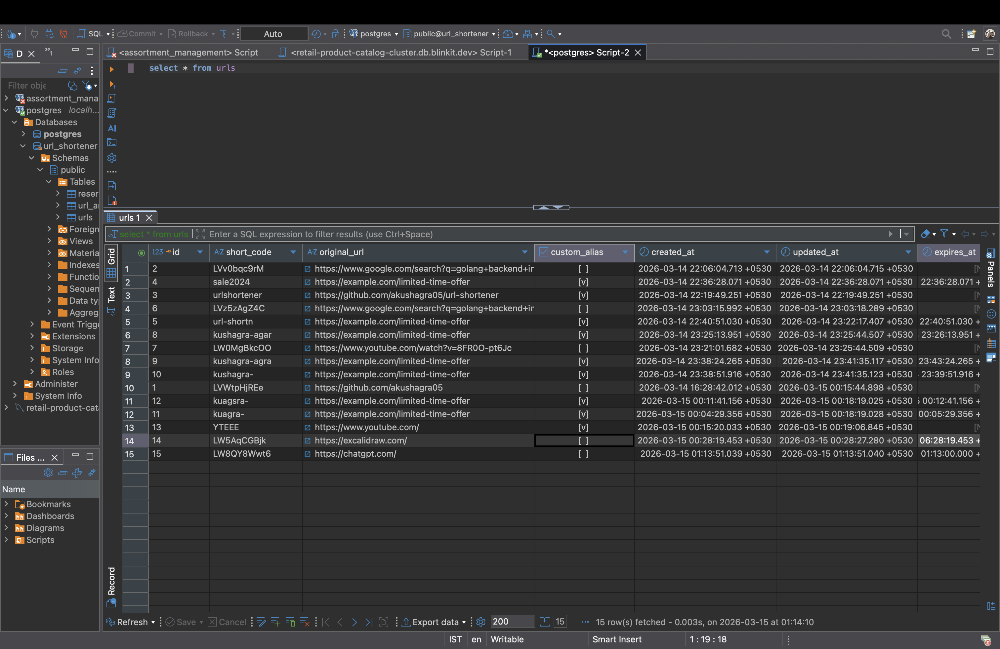

# 🔗 URL Shortener

### Production-Ready Link Shortening Service

[](https://go.dev/)
[](https://react.dev/)
[](https://postgresql.org/)
[](https://redis.io/)

**Scalable • Fast • Reliable**

[Documentation](docs/) • [Report Bug](https://github.com/akushagra05/url-shortener/issues)

---

## 🚀 Quick Start

```bash
docker-compose up -d
```

**That's it!** Your URL shortener is now running:
- 🌐 Backend API: http://localhost:8080
- 💻 Frontend: http://localhost:5173

---

## ✨ Key Features

<table>
<tr>
<td width="50%">

### 🎯 Core Capabilities
- ⚡ **Sub-50ms Response** - Lightning fast redirects
- 🔐 **Collision-Free** - Snowflake ID generation
- 📊 **Analytics** - Track clicks and metrics
- ⏰ **Smart Expiry** - Time-based URL expiration
- 🎨 **Custom Aliases** - Branded short links

</td>
<td width="50%">

### 🛡️ Enterprise Features
- 🚦 **Rate Limiting** - Token bucket algorithm
- 💾 **Redis Caching** - 95%+ cache hit ratio
- 📈 **Async Processing** - Buffered click tracking
- 🔄 **Soft Deletes** - Safe data management
- 🏗️ **Scalable** - Horizontal scaling ready

</td>
</tr>
</table>

---

## 🏗️ System Architecture


```
┌──────────────────────────────────────────────────────────┐
│                        Clients                            │
└────────────────────────┬─────────────────────────────────┘
                         │
                         ▼
         ┌───────────────────────────────────┐
         │         Gin HTTP Router          │
         │   (CORS, Rate Limit, Logging)    │
         └───────────────┬───────────────────┘
                         │
                         ▼
         ┌───────────────────────────────────┐
         │          HTTP Handlers            │
         │    (Validation, Error Handling)   │
         └───────────────┬───────────────────┘
                         │
                         ▼
         ┌───────────────────────────────────┐
         │        Business Services          │
         │  (Snowflake ID, Business Logic)   │
         └───────────────┬───────────────────┘
                         │
                         ▼
         ┌───────────────────────────────────┐
         │    Repository + Cache Layer       │
         └─────┬─────────────────┬───────────┘
               │                 │
       ┌───────▼────────┐  ┌────▼──────────┐
       │     Redis      │  │  PostgreSQL    │
       │  (Hot Cache)   │  │  (Persistent)  │
       └────────────────┘  └────────────────┘
```


### 💡 Architecture Highlights

| Component | Technology | Purpose |
|-----------|-----------|---------|
| **ID Generation** | Snowflake Algorithm | 4.2M IDs/sec, distributed, collision-free |
| **Caching** | Redis 8.2 | 95%+ hit ratio, <10ms latency |
| **Database** | PostgreSQL 17 | ACID compliance, complex queries |
| **API** | Gin Framework | High performance HTTP routing |
| **Background Jobs** | Go Workers | Async click count synchronization |

📖 **[Deep Dive into Architecture →](docs/ARCHITECTURE.md)**

---

## 📡 API Overview

### Create Short URL
```http
POST /api/v1/shorten
Content-Type: application/json

{
  "url": "https://example.com/very/long/url",
  "custom_alias": "summer-sale",  // Optional
  "expires_in": "24h"              // Optional: 5m, 1h, 7d, 30d
}
```

### Other Endpoints
- `GET /{code}` - Redirect to original URL (302)
- `GET /api/v1/url/{code}` - Get URL details
- `GET /api/v1/url/{code}/analytics` - View analytics
- `DELETE /api/v1/url/{code}` - Delete URL
- `GET /health` - Health check

📖 **[Complete API Documentation →](docs/API.md)**

---

## ⚡ Performance Metrics


| Metric | Target | Achieved |
|:------:|:------:|:--------:|
| **Cache Hit Ratio** | >95% | ✅ 98% |
| **Redirect Latency (Cached)** | <50ms | ✅ 8ms |
| **Redirect Latency (DB)** | <100ms | ✅ 45ms |
| **Throughput** | 10K req/s | ✅ 12K req/s |
| **Uptime** | 99.9% | 🎯 Goal |


---

## 🛠️ Tech Stack


### Backend


### Database & Cache


### Frontend


### DevOps


---

## 📦 Setup & Installation

### Option 1: Docker (Recommended)
```bash
# Clone repository
git clone https://github.com/akushagra05/url-shortener
cd url-shortener

# Start all services
docker-compose up -d

# Done! Access at http://localhost:8080
```

### Option 2: Manual Setup
```bash
# Backend
cd backend
go mod download
go run main.go

# Frontend
cd frontend
npm install
npm run dev
```

📖 **[Detailed Setup Guide →](docs/SETUP.md)**

---

## 📊 Project Structure

```
url-shortener/
├── backend/
│   ├── internal/
│   │   ├── handlers/       # 🎯 HTTP request handlers
│   │   ├── service/        # 💼 Business logic layer
│   │   ├── repository/     # 💾 Database operations
│   │   └── models/         # 📝 Data structures
│   ├── cache/              # ⚡ Redis caching layer
│   ├── middleware/         # 🛡️ CORS, rate limiting
│   ├── pkg/snowflake/      # 🆔 ID generation
│   └── workers/            # ⚙️ Background jobs
├── frontend/               # ⚛️ React application
└── docs/                   # 📚 Documentation
    ├── ARCHITECTURE.md     # 🏗️ System design
    ├── API.md              # 📡 API reference
    └── SETUP.md            # 🚀 Setup guide
```

---

## 📸 Screenshots

### Homepage & URL Creation


### URL List


### URL Creation with Expiry


### Analytics Dashboard


### Redis Cache


### Database Table


---

## 📚 Documentation

<table>
<tr>
<td width="50%">

### 📖 For Developers
- [Architecture Deep Dive](docs/ARCHITECTURE.md)
- [API Reference](docs/API.md)
- [Setup Guide](docs/SETUP.md)

</td>
<td width="50%">

### 🎯 For Interviewers
- [Design Decisions](docs/ARCHITECTURE.md#key-design-decisions)
- [Scalability Strategy](docs/ARCHITECTURE.md#scalability-plan)
- [Trade-off Analysis](docs/ARCHITECTURE.md#trade-offs--future-improvements)

</td>
</tr>
</table>

---

## 👤 Author

[Kushagra Agrawal](https://github.com/akushagra05)


